# locality_commontopo

DNS-focused local deployer topology for manual testing. The layout is defined in `newTopologySpec()` in `commontopo.go` (`topologySpec` → `clusterSpec` → `nodeSpec`).

## Topology

```mermaid
flowchart TB
  subgraph services["Services (topologyServices)"]
    svc1["service1 :8080<br/>5 per DC"]
    svc2["service2 :9080<br/>4 in dc2 only"]
  end

  subgraph dc1["dc1 · region-a · locality_aware_lookup=always"]
    subgraph z_a1["zone-a1 · 3× service1"]
      subgraph z_a1_srv["servers"]
        dc1s1["dc1-server1"]
        dc1s2["dc1-server2"]
      end
      subgraph z_a1_cli["clients"]
        dc1c1["dc1-client1<br/>query"]
        dc1c2["dc1-client2<br/>service1"]
        dc1c3["dc1-client3<br/>service1"]
        dc1c4["dc1-client4<br/>service1"]
      end
    end
    subgraph z_a2["zone-a2 · 2× service1"]
      subgraph z_a2_srv["servers"]
        dc1s3["dc1-server3"]
      end
      subgraph z_a2_cli["clients"]
        dc1c5["dc1-client5<br/>query"]
        dc1c6["dc1-client6<br/>service1"]
        dc1c7["dc1-client7<br/>service1"]
      end
    end
  end

  subgraph dc2["dc2 · region-b · locality_aware_lookup=balanced"]
    subgraph z_b1["zone-b1 · 3× service1 · 2× service2"]
      subgraph z_b1_srv["servers"]
        dc2s1["dc2-server1"]
        dc2s2["dc2-server2"]
      end
      subgraph z_b1_cli["clients"]
        dc2c1["dc2-client1<br/>query"]
        dc2c2["dc2-client2<br/>service1 · service2"]
        dc2c3["dc2-client3<br/>service1 · service2"]
        dc2c4["dc2-client4<br/>service1"]
      end
    end
    subgraph z_b2["zone-b2 · 2× service1 · 2× service2"]
      subgraph z_b2_srv["servers"]
        dc2s3["dc2-server3"]
      end
      subgraph z_b2_cli["clients"]
        dc2c5["dc2-client5<br/>query"]
        dc2c6["dc2-client6<br/>service1 · service2"]
        dc2c7["dc2-client7<br/>service1 · service2"]
      end
    end
  end

  dc1c2 & dc1c3 & dc1c4 & dc1c6 & dc1c7 --> svc1
  dc2c2 & dc2c3 & dc2c4 & dc2c6 & dc2c7 --> svc1
  dc2c2 & dc2c3 & dc2c6 & dc2c7 --> svc2

  classDef server fill:#e8f4fc,stroke:#0366d6
  classDef query fill:#fff8e1,stroke:#f9a825
  classDef workload fill:#e8f5e9,stroke:#2e7d32
  classDef service fill:#f3e5f5,stroke:#7b1fa2

  class dc1s1,dc1s2,dc1s3,dc2s1,dc2s2,dc2s3 server
  class dc1c1,dc1c5,dc2c1,dc2c5 query
  class dc1c2,dc1c3,dc1c4,dc1c6,dc1c7,dc2c2,dc2c3,dc2c4,dc2c6,dc2c7 workload
  class svc1,svc2 service
```



Legend: **query** = client with empty `Workloads` (see `NodesSpecs(..., "query", ...)`). Workloads are Fortio sidecars on the client agent. In `dc1` (`always`), DNS `A` answers are zone-local. In `dc2` (`balanced`), zone filtering depends on per-service zone counts: `service1` is uneven (`3` / `2`) and may return the whole datacenter; `service2` is even (`2` / `2`) and stays zone-local.

### Clusters (`clusterSpec`)

| Cluster | Datacenter | Region | Zones | `LocalityAwareLookup` |
|---------|------------|--------|-------|------------------------|
| `dc1` | `dc1` | `region-a` | `zone-a1`, `zone-a2` | `always` |
| `dc2` | `dc2` | `region-b` | `zone-b1`, `zone-b2` | `balanced` |

### `dc1` nodes (`nodeSpec`)

| Node | Role | Zone | Workloads |
|------|------|------|-----------|
| `dc1-server1` | server | `zone-a1` | — |
| `dc1-server2` | server | `zone-a1` | — |
| `dc1-server3` | server | `zone-a2` | — |
| `dc1-client1` | client | `zone-a1` | — |
| `dc1-client2` | client | `zone-a1` | `service1` |
| `dc1-client3` | client | `zone-a1` | `service1` |
| `dc1-client4` | client | `zone-a1` | `service1` |
| `dc1-client5` | client | `zone-a2` | — |
| `dc1-client6` | client | `zone-a2` | `service1` |
| `dc1-client7` | client | `zone-a2` | `service1` |

### `dc2` nodes (`nodeSpec`)

| Node | Role | Zone | Workloads |
|------|------|------|-----------|
| `dc2-server1` | server | `zone-b1` | — |
| `dc2-server2` | server | `zone-b1` | — |
| `dc2-server3` | server | `zone-b2` | — |
| `dc2-client1` | client | `zone-b1` | — |
| `dc2-client2` | client | `zone-b1` | `service1`, `service2` |
| `dc2-client3` | client | `zone-b1` | `service1`, `service2` |
| `dc2-client4` | client | `zone-b1` | `service1` |
| `dc2-client5` | client | `zone-b2` | — |
| `dc2-client6` | client | `zone-b2` | `service1`, `service2` |
| `dc2-client7` | client | `zone-b2` | `service1`, `service2` |

### Agent config (`buildNode` / `localityConfig`)

All agents use image `consul:local` (the dev image adds `bind-tools` so `dig` is available in agent containers).

Every server and client gets:

- node meta: `region`, `zone` (`localityMeta`)
- agent config: `locality { region = "...", zone = "..." }`

Client agents only also get:

- `dns_config { locality_aware_lookup = "<cluster LocalityAwareLookup>" }`

To add workloads, set `nodeSpec.Workloads` in `newTopologySpec()` (for example `[]serviceSpec{service1}` or `[]serviceSpec{service1, service2}`).

## DNS behavior (`TestCommonTopologySetup`)

Launch waits for passing registrations for every service with workloads (`waitForPassingServices`), then `assertDNSLocalityAwareLookup` runs `dig` from every query client (clients with no `Workloads`):

| Service | `dc1` (`always`) | `dc2` (`balanced`) |
|---------|------------------|---------------------|
| `service1` | zone-local (`3` / `2` per zone) | uneven (`3` / `2`) → may return whole datacenter |
| `service2` | empty (no workloads) | even (`2` / `2`) → zone-local |

Query clients: `dc1-client1`, `dc1-client5`, `dc2-client1`, `dc2-client5`.

## Run and inspect

```bash
make test-deployer-setup
cd test-integ
rm -rf /tmp/consul-locality-topology
SPRAWL_WORKDIR_ROOT=/tmp/consul-locality-topology SPRAWL_KEEP_RUNNING=1 NOLOGBUFFER=1 go test ./locality_commontopo -run TestCommonTopologySetup -v
```

`SPRAWL_KEEP_RUNNING=1` is honored by `sprawltest` only when the test **fails**. This package's test therefore ends with an intentional `t.Fail()` when that variable is set (after all checks pass), so containers stay up. Expect a **non-zero** exit from `go test` in that mode; tear down with `terraform destroy` under the workdir when finished.

The test logs print each node's region, zone, docker container name, exposed ports, and workloads (`LogTopology`), followed by ready-to-run DNS commands (`LogManualDNSCommands`).

Typical manual queries (prefer the query clients above):

```bash
docker exec <zone-local-client-container> dig @127.0.0.1 -p 8600 service1.service.consul A +short
docker exec <zone-local-client-container> dig @127.0.0.1 -p 8600 service2.service.consul A +short
```

Run lookups from a client in each zone (`zone-a1`, `zone-a2`, `zone-b1`, `zone-b2`) to compare behavior: `service1` is zone-local in `dc1` but may be datacenter-wide in `dc2`; `service2` is empty in `dc1` and zone-local in `dc2`.
